# 灵光 / Lighght

## 产品概述

灵光（Lighght）—— 一款创意共创微信小程序，用户通过文字、语音或图片发布创意灵感，其他用户可认领创意并提交实现成果（截图+视频+文字说明），形成"一个创意，多种实现"的社区共创模式。支持评论互动和内容安全审核。首页展示今日新鲜创意（当日不足时动态fallback补充近期创意），支持热度排行与随机推荐（去重），点赞/点踩社区互动。创意按应用市场22个分类标签归类，支持标签浏览。支持关键词搜索、收藏创意、消息通知、社交分享、关注用户。用户可编辑头像昵称，管理自己发布的创意和实现成果，查看互动记录，支持取消认领（含7天时效约束）。

## 核心功能

### 创意发布

- 手动文字输入（多行文本），发布前msgSecCheck审核
- 语音输入：wx.getRecorderManager录音→上传云存储→speechToText云函数转文字（主方案微信同声传译插件，降级腾讯云ASR API）
- 上传图片：wx.chooseMedia选择→前端压缩1920px→并行上传云存储临时目录→批量imgSecCheck审核→通过后移正式目录，不通过则删除
- 必选标签，按应用市场22个分类体系（游戏、社交、购物、教育、工具、生活、娱乐、新闻、音乐、视频、摄影、效率、健康、美食、旅游、金融、图书、导航、体育、商务、天气、医疗）
- 用户可编辑和删除自己发布的创意（删除时级联清除关联数据）
- 支持保存草稿（本地缓存，未发布前不写入数据库）

### 首页 - 今日创意（Tab1）

- 顶部搜索栏，点击跳转搜索页，支持关键词搜索创意
- 当天创意列表，每条附带发布者头像昵称、当前用户点赞状态(isLiked/isDisliked)、收藏状态(isFavorited)
- 显示内容摘要、图片缩略图网格、标签胶囊（可点击跳转标签浏览页）、点赞/点踩数、认领人数
- 下拉刷新，按发布时间倒序，触底分页加载（每页10条）
- 当日创意不足10条时，动态fallback补充近期创意（近7天→近30天）直至填满一页

### 热门栏目（Tab2）

- 按点赞数降序排列，附带发布者信息和点赞状态
- 热度进度条（点赞数-点踩数），触底分页加载

### 推荐栏目（Tab3）

- 随机展示（聚合管道$sample一次取N条），附带点赞状态
- 前端缓存已展示ID数组，换一批时去重
- 纵向滑动卡片列表，每屏展示1-2张卡片，保留翻转切换动效，提升浏览效率

### 互动功能

- 点赞/点踩互斥，toggleLike原子操作（事务保护），userLikes唯一索引(_openid+creativityId)去重
- 点赞/点踩切换逻辑：查现有记录→type相同则删除(取消)→type不同则更新type并调整两个计数器→无记录则插入
- 实现成果单独点赞toggleImplLike
- 所有返回列表/详情的接口注入当前用户点赞状态和收藏状态，前端据此高亮按钮

### 评论系统

- 创意详情页底部评论区块：每条评论含头像+昵称+时间+内容
- addComment云函数：发布前msgSecCheck审核文本，通过后写入comments集合，同步写入通知通知创意作者或被回复者
- getComments云函数：按creativityId查询+关联users注入头像昵称+分页
- deleteComment云函数：删除自己的评论（或创意作者可删除）
- 默认展示最新3条评论，"查看全部N条"展开

### 内容审核

- security.msgSecCheck：审核昵称、创意内容、实现描述、评论内容，违规则拒绝并返回错误码
- security.imgSecCheck：审核头像、创意配图、实现截图。先上传temp目录→批量并行调用审核→通过移正式目录，不通过删除temp文件
- security.mediaCheckAsync：异步审核实现成果视频，标记pending_review状态，审核结果通过onMediaCheckResult HTTP回调云函数更新为approved/rejected，rejected时隐藏视频并通知作者

### 多人认领与实现成果

- claimCreativity云函数校验唯一索引去重，写入claims（含expireAt=7天后）+claimCount+1
- 认领时效：7天内未提交成果，自动取消认领（定时任务清理过期claim，claimCount-1）
- 提交成果：文字描述（msgSecCheck审核）+截图≤9张（imgSecCheck批量审核）+视频≤30s（mediaCheckAsync异步审核）
- 版本模型：一个claim对应一条implementation文档，editImplementation原地更新并version递增，version仅标记编辑次数
- 成果默认折叠前3个+展开全部
- cancelClaim：已认领但未提交成果时可取消，删除claim+claimCount-1
- 可编辑和删除自己的实现成果

### 标签浏览

- 点击标签跳转标签浏览页，getCreativitiesByTag支持page/pageSize/sortBy分页
- 排序切换（最新/最热），复用creativity-card组件

### 搜索功能

- 搜索页支持关键词搜索创意content字段
- searchCreativities云函数：使用数据库正则匹配或全文搜索，支持分页
- 展示搜索结果列表，复用creativity-card组件
- 搜索历史本地缓存，热门搜索推荐

### 收藏功能

- 创意详情页和卡片支持收藏/取消收藏toggleFavorite
- favorites集合存储收藏记录（_openid+creativityId唯一索引去重）
- 我的页面增加"我的收藏"入口，getMyFavorites分页返回收藏的创意列表

### 通知系统

- notifications集合存储通知记录，类型包括：评论通知、回复通知、认领通知、审核结果通知
- 关键操作触发通知写入：addComment通知创意作者、二级回复通知被回复者、claimCreativity通知创意作者、视频审核结果通知作者
- getNotifications云函数：按_openid查询通知列表+分页，关联创意/评论数据
- markNotificationRead云函数：标记通知已读
- 我的页面消息入口，红点提示未读数，全部已读按钮

### 社交分享

- 所有内容页支持分享给微信好友(onShareAppMessage)和朋友圈(onShareTimeline)
- 分享卡片携带创意摘要和缩略图
- 详情页分享按钮，支持分享当前创意

### 用户主页

- 点击创意卡片上的发布者头像/昵称跳转用户主页
- 展示用户头像、昵称、发布的创意列表、实现成果列表
- getUserProfile云函数：按openid查询用户信息+发布的创意+实现的成果

### 关注用户

- 用户主页展示"关注/已关注"按钮（非自己时显示），toggleFollow云函数写入/删除follows记录
- follows集合存储关注关系（_openid+targetOpenid唯一索引去重）
- 我的页面增加"我关注的"入口，getFollowedCreativities云函数返回已关注用户最新创意流
- 关注的人发布新创意时推送通知

### 创意详情页

- swiper图片轮播、完整文字+语音播放条、标签胶囊栏（可点击跳转）
- 发布者头像昵称（可点击跳转用户主页）+时间+认领人数，点赞/点踩高亮
- 收藏按钮，分享按钮（分享给好友/朋友圈）
- 认领按钮区：未认领→"我要实现"、已认领无成果→"取消认领"、已提交→"更新实现成果"
- 实现成果列表区：默认折叠前3个+展开全部，含描述+截图9宫格+视频(含审核状态占位)+点赞状态+版本标签
- 评论区块：最新3条一级评论+展开全部+分页加载+底部评论输入框
- 作者可见编辑/删除按钮
- 详情页数据按需加载：页面加载时先拉创意基本信息+点赞/收藏状态，实现成果和评论各自独立分页加载

### 我的页面（Tab5）

- 紫蓝渐变背景用户信息卡：圆形头像+昵称+统计信息（发布数/实现数/获赞数），点击弹出编辑面板（chooseAvatar+nickname input）
- 顶部消息入口图标，红点提示未读通知数
- 五栏切换：「我发布的」「我实现的」「我的互动」「我的收藏」「我关注的」
- 我发布的：创意卡片列表含编辑/删除入口
- 我实现的：创意标题+成果摘要+版本号含编辑/删除入口
- 我的互动：分两子栏「我点赞的」「我评论的」，复用creativity-card组件展示关联创意列表
- 我的收藏：收藏的创意卡片列表，复用creativity-card组件
- 我关注的：getFollowedCreativities返回已关注用户最新创意流，复用creativity-card组件

### 互动记录查看

- getMyLikedCreativities云函数：按_openid查userLikes(type="like")→提取creativityId批量查creativities→关联users注入发布者头像昵称→分页返回
- getMyCommentedCreativities云函数：按_openid查comments→提取creativityId去重→批量查creativities→关联users→分页返回
- 前端在我互动页展示创意卡片列表，点击可跳转详情页

## 技术栈

- 前端框架：微信小程序原生框架（WXML+WXSS+JavaScript）
- 后端服务：腾讯云开发 CloudBase（云函数+云数据库+云存储+AI）
- 语音识别：wx.getRecorderManager录音+speechToText云函数（主方案微信同声传译插件，降级腾讯云ASR API）
- 内容审核：微信原生安全API（security.msgSecCheck / security.imgSecCheck / security.mediaCheckAsync + HTTP回调）
- 图片处理：wx.chooseMedia+CloudBase云存储，前端压缩1920px，并行批量审核
- 视频处理：wx.chooseMedia+CloudBase云存储，限制30秒时长，异步审核+HTTP回调
- 基础库版本：>=3.1.0

## 整体架构

采用微信小程序+CloudBase全栈架构。前端wx.cloud SDK直连云数据库只读操作（安全规则），写操作通过云函数统一处理。图片视频经temp目录审核后移正式目录。所有返回列表的云函数执行三步关联查询：查主数据→批量查users注入头像昵称→批量查userLikes/implLikes/favorites注入点赞状态和收藏状态。详情页数据按需分块加载，避免一次查询过重。计数器更新使用数据库事务保护一致性。

## 架构图

```mermaid
graph TD
    subgraph 小程序前端
        A[今日 today]
        B[热门 hot]
        C[推荐 recommend]
        D[发布 publish]
        E[详情 detail]
        M[我的 my]
        T[标签 tag]
        W[提交成果 submit-impl]
        S[搜索 search]
        U[用户主页 user]
        MC[消息中心 messages]
    end

    subgraph CloudBase 后端
        F0[initUserProfile]
        F1[updateProfile]
        F2[publishCreativity]
        F3[editCreativity]
        F4[deleteCreativity]
        F5[getTodayList]
        F6[getHotList]
        F7[getRecommendList]
        F8[getCreativitiesByTag]
        F9[toggleLike]
        F10[toggleImplLike]
        F11[speechToText]
        F12[getCreativityDetail]
        F13[claimCreativity]
        F14[cancelClaim]
        F15[submitImplementation]
        F16[editImplementation]
        F17[deleteImplementation]
        F18[getMyCreativities]
        F19[getMyImplementations]
        F20[getMyLikedCreativities]
        F21[getMyCommentedCreativities]
        F22[addComment]
        F23[getComments]
        F24[deleteComment]
        F25[onMediaCheckResult HTTP回调]
        F26[searchCreativities]
        F27[toggleFavorite]
        F28[getMyFavorites]
        F29[getUserProfile]
        F30[getNotifications]
        F31[markNotificationRead]
        F32[cleanExpiredClaims 定时任务]
        F33[toggleFollow]
        F34[getFollowedCreativities]
        L1[(users)]
        L2[(creativities)]
        L3[(userLikes)]
        L4[(claims)]
        L5[(implementations)]
        L6[(implLikes)]
        L7[(comments)]
        L8[(notifications)]
        L9[(favorites)]
        L10[(follows)]
        N[云存储 images/voices/videos/temp]
    end

    A --> F0
    B --> F0
    C --> F0
    M --> F0
    M --> F1
    D --> F2
    D --> F11
    D --> N
    A --> F5
    B --> F6
    C --> F7
    T --> F8
    E --> F12
    E --> F9
    E --> F13
    E --> F14
    E --> F15
    E --> F22
    E --> F23
    E --> F24
    E --> F27
    W --> F15
    W --> F16
    E --> N
    M --> F18
    M --> F19
    M --> F20
    M --> F21
    M --> F28
    M --> F30
    M --> F31
    E --> F3
    E --> F4
    E --> F16
    E --> F17
    S --> F26
    U --> F29
    MC --> F30
    MC --> F31
    U --> F33
    M --> F34
    F33 --> L10
    F34 --> L10
    F34 --> L2
    F34 --> L1
    F25 --> L5
    F25 --> L8
    F13 --> L8
    F22 --> L8
    F32 --> L4
    F5 --> L1
    F5 --> L2
    F5 --> L3
    F6 --> L1
    F6 --> L2
    F6 --> L3
    F7 --> L1
    F7 --> L2
    F7 --> L3
    F8 --> L1
    F8 --> L2
    F8 --> L3
    F12 --> L1
    F12 --> L2
    F12 --> L3
    F12 --> L5
    F12 --> L6
    F12 --> L7
    F20 --> L3
    F20 --> L2
    F20 --> L1
    F21 --> L7
    F21 --> L2
    F21 --> L1
    F23 --> L7
    F23 --> L1
    F18 --> L1
    F18 --> L2
    F19 --> L1
    F19 --> L5
    F26 --> L1
    F26 --> L2
    F26 --> L3
    F27 --> L9
    F28 --> L9
    F28 --> L2
    F28 --> L1
    F29 --> L1
    F29 --> L2
    F29 --> L5
    F30 --> L8
    F30 --> L2
```



## 数据模型

### 1. users 集合

| 字段 | 类型 | 说明 |
| --- | --- | --- |
| _id | String | 自动生成 |
| _openid | String | 用户唯一标识 |
| nickName | String | 昵称（默认"微信用户"） |
| avatarUrl | String | 头像URL |
| createdAt | Date | 注册时间 |
| updatedAt | Date | 最近更新时间 |


### 2. creativities 集合

| 字段 | 类型 | 说明 |
| --- | --- | --- |
| _id | String | 自动生成 |
| _openid | String | 发布者openid |
| content | String | 文字内容（最多400字） |
| voiceUrl | String | 语音文件URL |
| images | Array[String] | 图片URL数组 |
| tags | Array[String] | 标签数组 |
| likeCount | Number | 点赞数（默认0） |
| dislikeCount | Number | 点踩数（默认0） |
| claimCount | Number | 认领人数（默认0） |
| implCount | Number | 实现成果总数（默认0） |
| commentCount | Number | 评论数（默认0） |
| favoriteCount | Number | 收藏数（默认0） |
| createdAt | Date | 发布时间 |
| date | String | YYYY-MM-DD |


### 3. userLikes 集合

| 字段 | 类型 | 说明 |
| --- | --- | --- |
| _id | String | 自动生成 |
| _openid | String | 用户openid |
| creativityId | String | 关联创意ID |
| type | String | "like"或"dislike" |
| createdAt | Date | 操作时间 |

> 唯一索引：{ _openid: 1, creativityId: 1 }（不含type，保证同一用户对同一创意只有一条记录，实现互斥）


### 4. claims 集合

| 字段 | 类型 | 说明 |
| --- | --- | --- |
| _id | String | 自动生成 |
| _openid | String | 认领者openid |
| creativityId | String | 关联创意ID |
| status | String | "active"/"expired"/"cancelled" |
| expireAt | Date | 过期时间（createdAt+7天） |
| createdAt | Date | 认领时间 |


### 5. implementations 集合

| 字段 | 类型 | 说明 |
| --- | --- | --- |
| _id | String | 自动生成 |
| creativityId | String | 关联创意ID |
| claimId | String | 关联认领记录ID |
| _openid | String | 实现者openid |
| description | String | 实现说明文字 |
| screenshots | Array[String] | 截图URL数组（最多9张） |
| videoUrl | String | 视频URL（可选） |
| videoStatus | String | "pending_review"/"approved"/"rejected" |
| version | Number | 版本号（从1递增，每次编辑+1，标记编辑次数） |
| likeCount | Number | 成果点赞数（默认0） |
| createdAt | Date | 提交时间 |
| updatedAt | Date | 最近更新时间 |

> 一个claim对应一条implementation文档，editImplementation原地更新并递增version


### 6. implLikes 集合

| 字段 | 类型 | 说明 |
| --- | --- | --- |
| _id | String | 自动生成 |
| _openid | String | 用户openid |
| implementationId | String | 关联实现成果ID |
| createdAt | Date | 操作时间 |


### 7. comments 集合

| 字段 | 类型 | 说明 |
| --- | --- | --- |
| _id | String | 自动生成 |
| creativityId | String | 关联创意ID |
| _openid | String | 评论者openid |
| content | String | 评论内容 |
| parentId | String | 父评论ID，null=一级评论，非null=二级回复 |
| replyTo | String | 被回复用户openid（二级回复时填写） |
| replyToNickName | String | 被回复用户昵称（冗余字段避免额外查询） |
| createdAt | Date | 评论时间 |


### 8. notifications 集合

| 字段 | 类型 | 说明 |
| --- | --- | --- |
| _id | String | 自动生成 |
| _openid | String | 接收者openid |
| type | String | "comment"/"reply"/"claim"/"video_approved"/"video_rejected" |
| creativityId | String | 关联创意ID |
| fromOpenid | String | 触发者openid |
| fromNickName | String | 触发者昵称（冗余） |
| content | String | 通知摘要内容 |
| isRead | Boolean | 是否已读（默认false） |
| createdAt | Date | 通知时间 |


### 9. favorites 集合

| 字段 | 类型 | 说明 |
| --- | --- | --- |
| _id | String | 自动生成 |
| _openid | String | 用户openid |
| creativityId | String | 关联创意ID |
| createdAt | Date | 收藏时间 |


### 10. follows 集合

| 字段 | 类型 | 说明 |
| --- | --- | --- |
| _id | String | 自动生成 |
| _openid | String | 关注者openid |
| targetOpenid | String | 被关注者openid |
| createdAt | Date | 关注时间 |

> 唯一索引：{ _openid: 1, targetOpenid: 1 }（去重）


## 安全规则

| 集合 | 读取规则 | 写入规则 |
| --- | --- | --- |
| users | 所有用户可读 | 仅云函数可写 |
| creativities | 所有用户可读 | 仅云函数可写 |
| userLikes | 仅创建者可读 | 仅云函数可写 |
| claims | 仅创建者可读 | 仅云函数可写 |
| implementations | 所有用户可读 | 仅云函数可写 |
| implLikes | 仅创建者可读 | 仅云函数可写 |
| comments | 所有用户可读 | 仅云函数可写 |
| notifications | 仅创建者可读 | 仅云函数可写 |
| favorites | 仅创建者可读 | 仅云函数可写 |
| follows | 仅创建者可读 | 仅云函数可写 |


## 数据库索引

```
users:          { _openid: 1 }
creativities:   { date: 1, createdAt: -1 }    // 今日+fallback
                { likeCount: -1 }              // 热门排序
                { createdAt: -1 }              // 全局最新/搜索
                { _openid: 1, createdAt: -1 }  // 我的发布/用户主页
                { tags: 1, createdAt: -1 }     // 标签浏览
userLikes:      { _openid: 1, creativityId: 1 }  // 唯一索引（互斥去重）
                { creativityId: 1, type: 1 }     // 按创意统计点赞/点踩数
                { _openid: 1, type: 1 }          // 互动记录查询
claims:         { _openid: 1, creativityId: 1 }  // 去重
                { creativityId: 1 }              // 按创意查
                { expireAt: 1, status: 1 }       // 定时清理过期认领
implementations:{ creativityId: 1, createdAt: -1 }  // 按创意查成果
                { _openid: 1, createdAt: -1 }      // 我的实现
implLikes:      { _openid: 1, implementationId: 1 }  // 去重
                { implementationId: 1 }             // 按成果查点赞
comments:       { creativityId: 1, parentId: 1, createdAt: -1 }  // 一级评论+子回复
                { _openid: 1, createdAt: -1 }      // 我的评论+互动记录
notifications:  { _openid: 1, isRead: 1, createdAt: -1 }  // 通知列表+未读统计
favorites:      { _openid: 1, creativityId: 1 }  // 唯一索引去重
                { _openid: 1, createdAt: -1 }     // 我的收藏
follows:        { _openid: 1, targetOpenid: 1 }  // 唯一索引去重
                { _openid: 1, createdAt: -1 }     // 我关注的
                { targetOpenid: 1, createdAt: -1 } // 我的粉丝
```

## 关键实现细节

### 1. 图片批量并行审核流程

前端并行上传所有图片到临时目录 cloud://temp/xxx → 一次调用云函数传入所有temp fileID → 云函数Promise.all并行下载为buffer并调用security.imgSecCheck → 全部通过则批量move到正式目录cloud://images/xxx → 任一不通过则delete所有temp文件+返回错误码+标注不通过的图片

### 2. 文本审核埋点

所有用户输入文本（昵称/创意内容/实现描述/评论内容）在写入数据库前调用security.msgSecCheck(content)，违规则拒绝请求返回特定错误码

### 3. 视频异步审核+HTTP回调

submitImplementation上传视频后标记videoStatus="pending_review"，调用security.mediaCheckAsync提交审核（携带traceId和creativityId）。审核结果通过微信回调URL返回→onMediaCheckResult HTTP触发器云函数接收→根据traceId匹配implementation→更新videoStatus为"approved"或"rejected"→rejected时写入notification通知作者重新上传。前端在详情页对pending_review的视频显示"审核中"占位符，rejected的视频显示"视频未通过审核"。

### 4. 用户信息+点赞状态+收藏状态关联查询

所有列表类云函数执行四步：查主数据→提取所有_openid批量查users组装头像昵称→提取所有creativityId+当前用户openid批量查userLikes注入isLiked/isDisliked→批量查favorites注入isFavorited

### 5. 删除创意的级联清除（分批+事务）

deleteCreativity使用事务+分批处理：删除creativities→分批查询并删除claims（每批50条）→分批删除implementations+implLikes→分批删除userLikes→分批删除comments→分批删除claims→删除favorites→异步删除云存储关联文件（不阻塞主流程）。每批操作间检查剩余时间，超时风险时返回"删除中，稍后完成"提示。

### 6. 删除实现成果

deleteImplementation（事务）：删除implementations→删除implLikes→删除关联claim→creativities.claimCount-=1→creativities.implCount-=1→异步删除云存储关联文件

### 7. 推荐随机算法（聚合管道）

使用CloudBase聚合管道$sample一次取N条随机记录，配合前端已展示ID数组去重。避免skip(offset)导致的O(N)性能问题。
```javascript
db.collection('creativities')
  .aggregate()
  .match({ _id: _.nin(shownIds) })
  .sample({ size: 10 })
  .end()
```

### 8. 今日列表分页+动态fallback

getTodayList支持page/pageSize分页。先查当日创意，如果当日总数不足一页(10条)，动态fallback：先补充近7天创意，仍不足则补充近30天，直至填满一页。返回数据附带date标记，前端可区分展示"今日"和"近期"分组。

### 9. 评论系统（二级嵌套+通知）

- addComment：新增 parentId/replyTo/replyToNickName 参数。一级评论(parentId=null)同步 commentCount+=1，二级评论不累计 commentCount。均需 msgSecCheck 审核。审核通过后写入notification：一级评论通知创意作者，二级回复通知被回复者。
- getComments：先查一级评论(parentId=null)→提取一级ID用 `_.in()` 批量查子回复→关联 users 注入头像昵称→组装嵌套结构返回→分页仅按一级评论分页
- deleteComment：删除一级评论时级联删除所有子回复，同步 commentCount-=1；删除二级回复仅删自身，不影响计数
- deleteCreativity 级联删除所有 comments 及子回复

### 10. 互动记录查询

getMyLikedCreativities：按_openid+type="like"查userLikes→提取所有creativityId→db.command.in()批量查creativities（不存在则过滤掉，不报错）→关联users→分页返回
getMyCommentedCreativities：按_openid查comments→提取所有creativityId去重→db.command.in()批量查creativities（不存在则过滤掉）→关联users→分页返回

### 11. 用户初始化优化

initUserProfile在app.js onLaunch中调用一次，通过wx.getStorageSync('hasInit')缓存标记，避免每个页面onLoad重复调用。用户主动编辑资料后清除缓存重新获取。

### 12. 认证鉴权

所有写操作云函数通过cloud.getWXContext().OPENID获取当前用户，编辑/删除操作校验_openid===doc._openid

### 13. 点赞互斥逻辑（事务保护）

toggleLike使用数据库事务：
1. 查询userLikes是否存在该用户+该创意的记录
2. 若存在且type相同 → 删除记录，likeCount或dislikeCount-1（取消操作）
3. 若存在且type不同 → 更新type，原计数-1，新计数+1（切换操作）
4. 若不存在 → 插入新记录，对应计数+1（新增操作）
全程在事务中执行，失败则回滚，保证计数器一致性。

### 14. 认领时效管理

- claimCreativity写入claims时设置expireAt = createdAt + 7天
- cleanExpiredClaims定时云函数（每日执行）：查询status="active"且expireAt<now的claims→更新status="expired"→creativities.claimCount-=1→写入notification通知认领者
- cancelClaim和submitImplementation成功后将claim.status更新为"completed"（或保持active但设置新的过期逻辑）

### 15. 搜索功能实现

searchCreativities云函数：对content字段使用正则匹配（db.RegExp）或数据库全文搜索（需建索引）。支持page/pageSize分页，返回结果复用四步关联查询注入用户信息和点赞/收藏状态。搜索历史存储在本地localStorage，展示热门搜索词。

### 16. 通知系统实现

- 写入时机：addComment（通知创意作者/被回复者）、claimCreativity（通知创意作者）、onMediaCheckResult（视频审核结果通知作者）
- getNotifications：按_openid查notifications，按createdAt降序分页，关联creativities注入创意标题
- markNotificationRead：支持单条标记已读和全部已读
- 前端我的页面消息入口红点：查isRead=false的count

### 17. 分享功能实现

所有内容页面配置onShareAppMessage和onShareTimeline：
- 创意详情页：分享标题取content前30字，配图取images[0]，path带creativityId参数
- 标签浏览页：分享标题"标签:xxx的创意"，path带tag参数
- 用户主页：分享标题"xxx的创意主页"，path带openid参数

### 18. 详情页按需加载

getCreativityDetail拆分为多次请求：
- 页面加载：拉创意基本信息+发布者信息+当前用户点赞/收藏状态
- 实现成果区：独立分页加载getImplementations(creativityId, page)
- 评论区：独立分页加载getComments(creativityId, page)
避免一次查询涉及过多集合导致响应慢。

### 19. 性能优化

- 图片前端压缩至1920px宽度，视频限制30秒
- 图片批量并行审核（Promise.all）
- 列表图片懒加载lazy-load
- 实现成果列表分页（每页10条）
- 今日列表分页+动态fallback
- 详情页按需分块加载
- 推荐算法使用$sample避免skip性能问题

### 20. 创意内容字数限制

发布页文本域设置maxlength=400，右上角实时显示"当前字数/400"。云函数publishCreativity和editCreativity中二次校验content.length<=400，超出则拒绝并返回错误码。语音转文字结果同样受400字限制，超出时截断并提示用户。

### 21. 关注用户

- toggleFollow云函数：查follows是否存在(_openid+targetOpenid)记录→存在则删除(取消关注)→不存在则插入(关注)
- getFollowedCreativities云函数：按_openid查follows提取targetOpenid数组→用`_.in()`批量查creativities（按createdAt降序）→关联users注入头像昵称→批量查userLikes/favorites注入点赞和收藏状态→分页返回
- getUserProfile云函数返回时附带当前用户是否关注了该用户（isFollowing字段），前端据此显示"关注/已关注"按钮状态
- publishCreativity成功后，查follows中targetOpenid=发布者的记录→为每个关注者写入notification通知

采用现代极简 + 活力渐变风格，以紫蓝渐变为主色调，暖橙为交互强调色，白色卡片承载内容。五栏底部Tab导航，卡片式内容流。设计年轻化、轻快活泼，适合创意灵感共创社区。

## 页面设计要点

### 今日页面（Tab1）

- 顶部紫蓝渐变头部，显示日期和"今日创意"标题，下方搜索栏入口
- 创意卡片列表：发布者头像+昵称、文字摘要3行、图片缩略图网格、标签胶囊（可点击跳转标签浏览页）、点赞/点踩数+高亮状态、收藏按钮、认领人数徽章
- 空状态插画+"今天还没有创意，快来发布第一个吧"；数据不足时自动fallback补充近期创意，分组显示"今日"和"近期"
- 下拉刷新+触底分页加载

### 热门页面（Tab2）

- 火焰图标+"热门创意"头部
- 左侧排名数字（前3金银铜色），右侧创意卡片+热度渐变进度条
- 触底分页加载

### 推荐页面（Tab3）

- 骰子图标+"探索创意"头部
- 纵向滑动卡片列表，每屏1-2张卡片，轻微浮动阴影，完整内容呈现
- "换一批"按钮+点赞/点踩/收藏组，卡片翻转切换动效

### 发布页面（Tab4）

- 大文本域（placeholder:"分享你的创意灵感..."，maxlength=400，右上角实时显示"当前字数/400"计数器）
- 圆形麦克风按钮（长按录音，红色脉冲动效）
- 已上传图片九宫格预览（支持删除）
- 可滚动标签云（选中高亮紫色，多选）
- 底部固定渐变紫色发布按钮+保存草稿按钮

### 关注用户

- 用户主页展示"关注/已关注"按钮（非自己时显示），toggleFollow云函数写入/删除follows记录
- follows集合存储关注关系（_openid+targetOpenid唯一索引去重）
- 我的页面增加"我关注的"入口，展示已关注用户最新创意流
- 关注的人发布新创意时推送通知

### 创意详情页

- swiper图片轮播（双击放大预览）
- 完整文字内容+语音播放条
- 标签胶囊行（可点击跳转标签页）
- 发布者头像昵称（可点击跳转用户主页）+发布时间
- 点赞/点踩按钮组（当前用户状态高亮）+收藏按钮+分享按钮
- 认领按钮区：未认领→"我要实现"橙色、已认领无成果→"取消认领"、已提交→"更新实现成果"紫色
- 作者可见编辑/删除按钮
- 实现成果列表区："社区实现(N)"，默认折叠前3个+"展开全部"，含描述+截图9宫格+视频(审核中显示占位符)+点赞状态+版本标签
- 评论区块：最新3条一级评论+展开全部+底部评论输入框。每条一级评论下展示子回复列表（默认折叠，点击展开），支持回复他人（@昵称）

### 标签浏览页

- 顶部标签名称标题+创意总数
- 排序切换（最新/最热）
- 创意卡片列表，分页加载

### 提交实现成果页

- 描述文本域
- 截图9宫格上传（支持删除）
- 视频选择按钮+缩略图预览
- 底部固定渐变绿色提交按钮

### 搜索页

- 顶部搜索输入框+搜索按钮
- 未搜索时展示搜索历史（本地缓存）+热门搜索词
- 搜索结果列表，复用creativity-card组件，分页加载
- 空结果状态"没有找到相关创意"

### 用户主页

- 顶部紫蓝渐变用户信息卡：头像+昵称+统计（发布数/实现数）+关注按钮（非自己时显示"关注"/"已关注"）
- 两栏切换：「TA发布的」「TA实现的」
- 创意卡片列表/成果列表，分页加载

### 消息中心页

- 通知列表：每条含类型图标+触发者头像昵称+摘要+时间
- 全部已读按钮
- 点击通知跳转对应创意详情
- 空状态"暂无消息"

### 我的页面（Tab5）

- 紫蓝渐变背景用户信息卡：圆形头像+昵称+统计信息（发布数/实现数/获赞数），点击弹出编辑面板（chooseAvatar+nickname input）
- 顶部消息入口图标，红点提示未读通知数
- 五栏切换：「我发布的」「我实现的」「我的互动」「我的收藏」「我关注的」
- 我发布的：创意卡片列表，含编辑/删除入口
- 我实现的：创意标题+成果摘要+版本号，含编辑/删除入口
- 我的互动：两子栏「我点赞的」「我评论的」，展示关联创意卡片列表
- 我的收藏：收藏的创意卡片列表，复用creativity-card组件
- 我关注的：已关注用户最新创意流，复用creativity-card组件

## Agent Extensions

### MCP

- **CloudBase MCP**
- 用途：管理云开发环境完整生命周期——auth登录、数据库10个集合创建+索引配置+安全规则、35个云函数创建部署（含1个HTTP触发器+1个定时任务）、云存储bucket权限管理及temp/images/voices/videos目录创建
- 预期结果：完成CloudBase后端环境搭建，所有集合、索引、安全规则、云函数部署就绪，存储目录结构就绪

### Skill

- **miniprogram-development**
- 用途：获取微信小程序开发规范、CloudBase集成最佳实践、chooseAvatar/nickname input/security.msgSecCheck/security.imgSecCheck/mediaCheckAsync回调/onShareAppMessage/onShareTimeline等API用法
- 预期结果：项目代码符合小程序最新标准，CloudBase SDK集成正确，内容审核API调用规范，分享功能配置正确

- **ui-design**
- 用途：为11个核心页面（今日/热门/推荐/发布/详情+评论+实现成果/我的(含四栏)/标签浏览/提交实现成果/搜索/用户主页/消息中心）和3个通用组件（creativity-card/implementation-card/tag-selector）生成高质量UI设计
- 预期结果：完整页面视觉设计，布局配色动效细节完善

- **spec-workflow**
- 用途：按标准软件工程流程进行需求分析、技术设计和任务规划
- 预期结果：结构化开发计划，多模块有序推进
